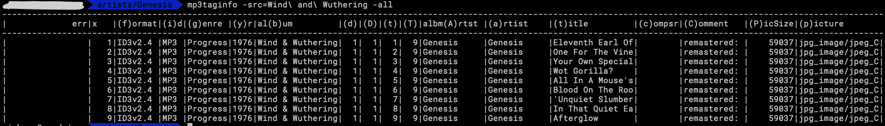

# mp3taginfo
---


---
- Prints and checks mp3 tags.
- Compares various meta data elements and throws flags to indicate where differences are found.
- Groups on meta-tags 'Artist' and 'Album'

```
./mp3taginfo - Version: 0.83
 ex.  ./mp3taginfo -src=./

  FLAGS ---------
  -all
    	Prints info on ALL files regardless of Tag irregularities
  -comment
    	compares *comment* fields
  -composer
    	compares *composer* fields
  -disccountzero
    	checks for EMPTY *disccount* (default true)
  -minimumpicsize int
    	compares *picSize* fields against this minimum value (default 8000)
  -picture
    	compares *picture* fields (default true)
  -src string
    	<REQUIRED> Source of MP3's to parse for Tags
  -trackcountzero
    	checks for EMPTY *trackcount* (default true)
  -usage
    	This message
  -version
    	Version info```
